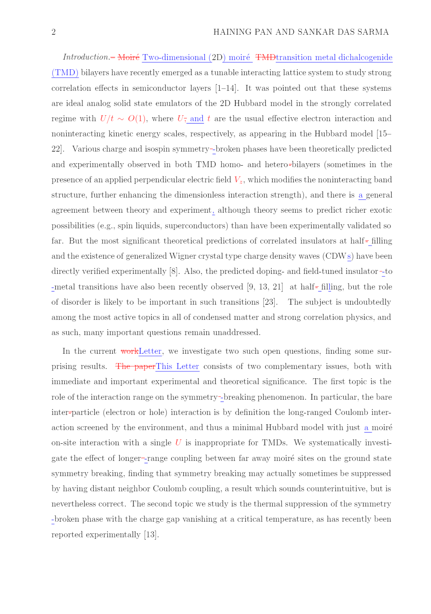
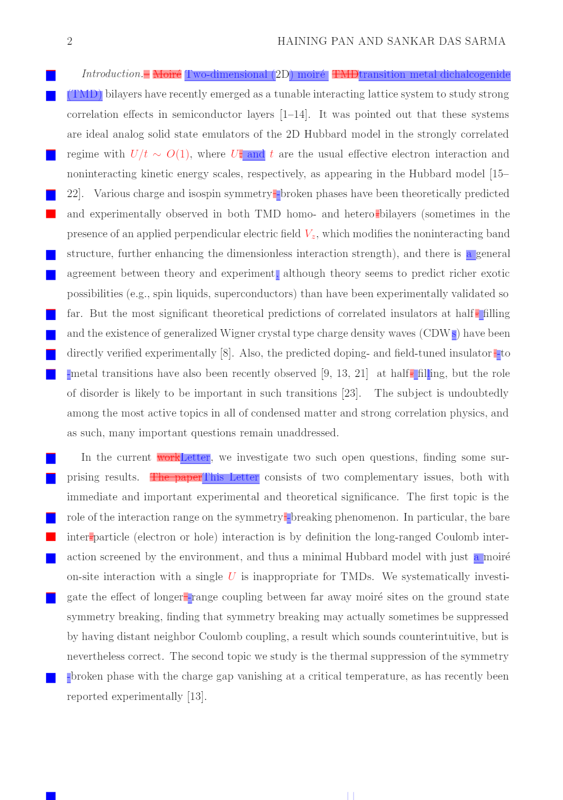

# Project: eProof helper
This repository is meant to help eProof when the manuscript is under the production process. The working scenario is when the manuscript is modified by the copyeditor and returned to me. The marks for indicating the changes are usually not very perceivable. (See below)

Therefore, this snippet can help eProof a bit easier by (1) converting the thin strikethroughs into background colors; (2) adding a colored block before each line whenever there is a change in that line (red indicates deletions, blue indicates addition). (See below) 

Therefore, the authors can be aware of the changes more easily, which may be further helpful, for example, in updating the arXiv version of the manuscript.

# Method
1. Convert the redline PDF file to html. [https://cloudconvert.com/pdf-converter]
2. `python eproof.py`, then enter the path of the HTML file. The filename of the converted HTML will be appended `_mod`.

# Note:
The template is the APS journals such as [Physical Reviews Letters](https://journals.aps.org/elecproofs.html).  

# To do:
1. Remove the mysterious blue block at the end of each page.
2. When the equations are rendered in red, the fraction lines and square root signs may be misidentified as strikethroughs. 
